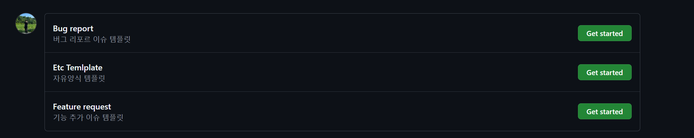
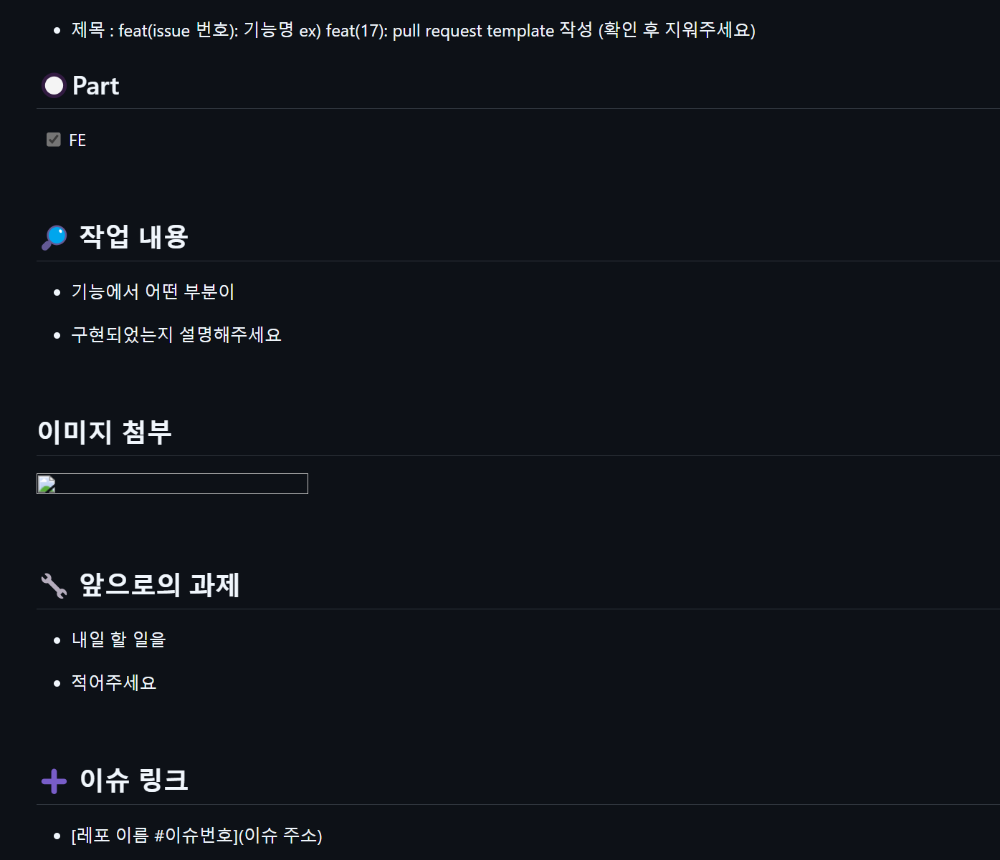

# Front

## <UMC 7th - 팀 이거먹자>

### 👨‍💻GitHub Convention

### **🤖** 안드로이드
**Category**  **TechStack** 
- Tool : Android Studio
- Language : kotlin
- Network : Retrofit, OkHttp, Gson 
- Service : Service 
- Asynchronous : Coroutines 
- Jetpack : DataBinding, Navigation 
- Image : Glide 

2. **Branch 전략**
   - 맡은 기능 또는 맡은 사람별로 Branch 결정

     1) 사람별로 Branch 개설 후 기능별로 구현  
     2) 아래와 같은 `feat` 별 개설 전략 활용  


     ```
     
     master: 라이브 서버에 제품으로 출시되는 브랜치.
     develop: 다음 출시 버전을 대비하여 개발하는 브랜치.
     feature: 추가 기능 개발 브랜치. develop 브랜치에 들어간다.
     release: 다음 버전 출시를 준비하는 브랜치. develop 브랜치를 release 브랜치로 옮긴 후 QA, 테스트를 진행하고 master 브랜치로 합친다.
     hotfix: master 브랜치에서 발생한 버그를 수정하는 브랜치.
     ```

   - **Team 이거먹자 Branch 예시**  
     `main > develop > feat(issue)`

---

3. **Issue Convention 결정 및 템플릿 작성**
   ### [Issue 작성 가이드](https://puleugo.tistory.com/165#Issue)
   - 담당자(Assignees)를 명시할 것
   - Task list 기능을 적극 활용할 것
   - 기능 관련 Issue라면 GitHub Project와 PR과 연동하여 진행상황 공유
   ### issue template > branch > pr template > merge 식으로 issue 관리가능
  > 자세한 내용은 템플릿 참고

  ## Issue Template 작성완료
  


---

4. **PR Convention 결정 후 템플릿 작성**
   ### [Pull Request 작성 가이드](https://puleugo.tistory.com/165#Pull-Request)
   - 제목은 '[#기능 번호] 변경 사항' 구조로 작성할 것
   - Issue와 연동할 것
      - 제목: **[Feat]** 핵심적인 부분만 간략하게 작성
   - 내용: 간결하게 리스트 방식으로 정리
   - 라벨: `FE`, `BE`, `기능추가`, `리팩토링`, `레이아웃`, `에러`


   > **자주 커밋하고 PR은 300자를 넘지 않도록 주의**  
   > (짧은 간격으로 자주 PR)
  ###  PR Template 작성완료
 > 자세한 내용은 템플릿 참고
 


5. **Commit Convention**

제목에는 본 커밋의 종류를 알려줍니다.

**제목 타입**: <type>

- feat: 기능 (feature)
- fix: 버그 수정
- docs: 문서 작업 (documentation)
- style: 포맷팅, 세미콜론 누락 등.
- refactor: 리팩터링 : 결과의 변경 없이 코드의 구조를 재조정
- test: 테스트
- chore: 관리(maintain), 핵심 내용은 아닌 잡일 등*// chore: [하기 싫은 따분한 일, 정기적으로 하는 일](https://en.dict.naver.com/#/search?query=chore)이라는 의미를 가지고 있습니다.*

6. **Code Convention**
팀에서 통일된 코드 스타일을 따르기 위해 아래 규칙을 준수합니다.
- 파일 소스명, package 통합
- 메서드 , 변수명 통합
- solid pattern 결정 후 구조화

### xml 작성시
- id 설정(중복확인)
- 통합된 source 파일사용 
### kotlin 작성시
- findViewID 사용시 -> id 통합, 초기화시 변수명 확인
- viewBinding 사용시 -> id 통합

>> 추가사항 계속 작성 요망

7. Android Studio, targetSDK, minSDK version 통일 
- Android Studio → LadyBug 2.1
- targetSdk→ 34
- midSdk → 28
- jvmTarget = 1.8

8. IDE -> emulator or device 결정
- device 기준 pixel 고정 후 작업
---


#### **Java Code Convention example**
- **Oracle Java Code Convention**을 따릅니다.  
  [참고 링크](https://www.oracle.com/java/technologies/javase/codeconventions-contents.html)

## 참고 자료
- [GitHub Flow & Git Flow](https://inpa.tistory.com/entry/GIT-%E2%9A%A1%EF%B8%8F-github-flow-git-flow-%F0%9F%93%88-%EB%B8%8C%EB%9E%9C%EC%B9%98-%EC%A0%84%EB%9E%B5)
- [Branch 전략](https://velog.io/@kw2577/Git-branch-%EC%A0%84%EB%9E%B5)
- [Git Convention Example](https://chlolisher.tistory.com/173)
